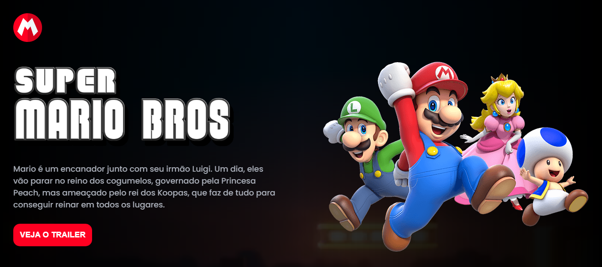

<h2 id="sobre-o-projeto">1. ⭐ Super Mario Bros - O Filme 🍄🎬</h2>


[](https://github.com/Domisnnet/Mario-Brothers-Web-Essentials/blob/main/LICENSE)



Bem-vindo ao repositório oficial do **Super Mario Bros - O Filme**! Esta é uma landing page imersiva e responsiva criada com **HTML, CSS e JavaScript Vanilla**, inspirada no universo visual do filme da Illumination/Nintendo. O projeto apresenta um vídeo de fundo em loop, um modal premium com o trailer oficial e um design temático completo.

---

## 📚 Tabela de Conteúdo

| 💻 O Projeto | 🛠️ Técnico | 🤝 Comunidade |
| :--------------------------------------------------------------------------------------: | :------------------------------------------------------------------------------------------: | :-------------------------------------------------------------------------------------: |
| [](#sobre-o-projeto) | [](#destaques-tecnicos) | [](#codigo-fonte) |
| [](#tecnologias-utilizadas) | [](#instalacao) | [](#creditos) |
| [](#como-acessar) | [](#como-contribuir) | [](#licenca) |
| [](#funcionalidades) | [](#faq) | [](#perfil-do-github) |

---

<h2 id="tecnologias-utilizadas">2. ⚙️ Tecnologias Utilizadas</h2>

| Camada | Tecnologias | Descrição |
| :-------------- | :------------------------------------------------------------------------------------------------------------------ | :--------------------------------------------------------------- |
| **Estrutura** |  | Marcação semântica da landing page. |
| **Estilo** |  | Estilos, animações e layout responsivo com Vanilla CSS. |
| **Interação** |  | Modal de trailer com controle de vídeo HTML5 nativo. |
| **Hosting** |  | Hospedagem estática via CDN do GitHub, custo zero. |
| **Tipografia** |  | Fonte Poppins em múltiplos pesos para leitura elegante. |

---

<h2 id="como-acessar">3. 🚀 Como Acessar</h2>

Clique no botão abaixo para entrar no Reino dos Cogumelos:

<div align="left">
  <a href="https://domisnnet.github.io/Mario-Brothers-Web-Essentials/" target="_blank">
    
  </a>
</div>

---

<h2 id="funcionalidades">4. 🧩 Funcionalidades Principais</h2>

| Funcionalidade | Descrição |
| :-------------------------------- | :------------------------------------------------------------------------------------------ |
| 🎬 **Vídeo de Fundo em Loop** | Vídeo `mario.mp4` em autoplay, mudo e totalmente responsivo cobrindo a viewport. |
| 🪟 **Modal com Trailer** | Modal com backdrop escurecido e transição suave para exibir o trailer do filme. |
| ▶️ **Player HTML5 Premium** | Elemento `<video>` nativo com bordas arredondadas, brilho vermelho e controles nativos. |
| 🔴 **Botão de Fechar Animado** | Botão circular que roda 90° e muda de cor no hover para uma UX premium. |
| 📱 **Layout Responsivo** | Media queries adaptam o conteúdo para desktop, tablet e mobile sem quebrar o design. |
| 🖼️ **Tipografia Personalizada** | Google Fonts Poppins com múltiplos pesos para hierarquia visual fiel ao estilo do filme. |

---

<h2 id="destaques-tecnicos">5. 💻 Destaques Técnicos</h2>

### 🎥 Vídeo de Fundo Full-Screen

O vídeo de fundo usa `object-fit: cover` combinado com `transform: scale(1.35)` para preencher toda a tela sem barras pretas, independente do aspect ratio da janela. Uma pseudo-camada `::after` aplica um gradiente escuro lateral para garantir legibilidade do texto.

### 🎭 Sistema de Modal Puro em JS

O modal é controlado com apenas `classList.toggle("aberto")` e manipulação direta do atributo `src` do elemento `<video>` — zero dependências externas. O play/pause é gerenciado programaticamente no abrir/fechar.

---

<h2 id="instalacao">6. 🚀 Instalação e Configuração Local</h2>

```bash
# Clonar o repositório
git clone https://github.com/Domisnnet/Mario-Brothers-Web-Essentials.git

# Acessar a pasta
cd Mario-Brothers-Web-Essentials
```

O GitHub Pages atualiza automaticamente em alguns segundos após o push.

---

<h2 id="como-contribuir">7. 🤝 Como Contribuir</h2>

Siga os passos abaixo para sugerir melhorias:

| Fase | Ação | Link / Comando |
| :----: | :--------- | :----------------------------------------------------------------------------------------------------------------------------------------------------------- |
| **01** | **Fork** | [](https://github.com/Domisnnet/Mario-Brothers-Web-Essentials/fork) |
| **02** | **Branch** | `git checkout -b feature/MinhaMelhoria` |
| **03** | **Commit** | `git commit -m 'feat: add nova funcionalidade'` |
| **04** | **Push** | `git push origin feature/MinhaMelhoria` |
| **05** | **PR** | [](https://github.com/Domisnnet/Mario-Brothers-Web-Essentials/compare) |

### 🐛 Encontrou um problema?

[](https://github.com/Domisnnet/Mario-Brothers-Web-Essentials/issues)
[](https://github.com/Domisnnet/Mario-Brothers-Web-Essentials/issues/new)

---

<h2 id="faq">8. 🧠 Perguntas Frequentes</h2>

<details>
<summary><strong>Por que o vídeo de fundo está com zoom? ❓</strong></summary>
<p>🎬 <strong>Resposta:</strong> O arquivo <code>mario.mp4</code> possui barras pretas (letterbox) no topo e na base. Aplicamos um <code>transform: scale(1.35)</code> combinado com <code>object-fit: cover</code> para cortar essas bordas e garantir que o vídeo ocupe plenamente toda a viewport.</p>
</details>

<details>
<summary><strong>Por que o modal usa um elemento video ao invés de um iframe? ❓</strong></summary>
<p>▶️ <strong>Resposta:</strong> Como o vídeo do trailer está hospedado localmente (<code>vídeo/mario.mp4</code>), usamos o elemento nativo <code>&lt;video&gt;</code> do HTML5 para streaming direto, sem depender da API do YouTube ou de serviços externos.</p>
</details>

<details>
<summary><strong>O site funciona em dispositivos mobile? ❓</strong></summary>
<p>📱 <strong>Resposta:</strong> Sim! O layout é totalmente responsivo usando media queries para adaptar os componentes — abaixo de 1200px o vídeo de fundo é substituído por uma cor sólida e o layout reordena os elementos verticalmente.</p>
</details>

<details>
<summary><strong>Posso utilizar este projeto como base para o meu portfólio? ❓</strong></summary>
<p>🤝 <strong>Resposta:</strong> Com certeza! O projeto é <strong>Open Source</strong> sob a <strong>Licença MIT</strong>. Sinta-se livre para clonar, estudar e adaptar — apenas lembre-se de dar os devidos créditos ao autor original.</p>
</details>

---

<h2 id="codigo-fonte">9. 💻 Código Fonte</h2>

Explore o projeto completo no repositório oficial:


[](https://github.com/Domisnnet/Mario-Brothers-Web-Essentials)

---

<h2 id="creditos">10. 📝 Créditos & Reconhecimentos</h2>

| Atribuição | Responsável / Recurso | Descrição |
| :------------------ | :--------------------------- | :------------------------------------------------------ |
| **Frontend Dev** | **DomisDev** | Design, HTML/CSS/JS e configuração de deploy. |
| **Fonte do Filme** | **Nintendo / Illumination** | Personagens, logotipo e identidade visual do universo. |
| **Infraestrutura** | **GitHub Pages** | Hospedagem estática gratuita via CDN global. |
| **Apoio Técnico** | **Google Gemini** | Padronização, refinamento e auxílio no desenvolvimento. |

---

<h2 id="licenca">11. 📄 Licença</h2>

Este projeto está sob a [](https://github.com/Domisnnet/Mario-Brothers-Web-Essentials/blob/main/LICENSE)

---

<h2 id="perfil-do-github">12. 👨‍💻 Perfil do GitHub</h2>

<a href="https://github.com/Domisnnet">
  
</a>